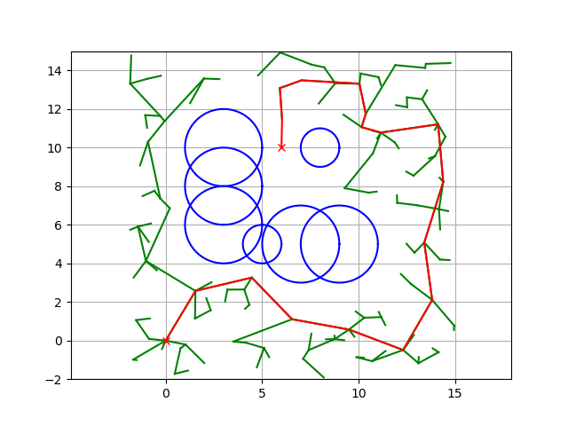
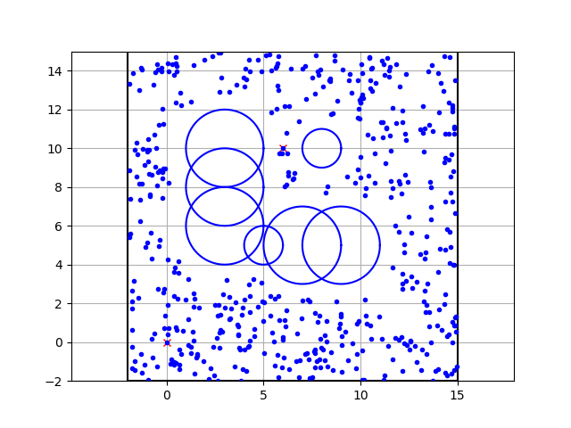
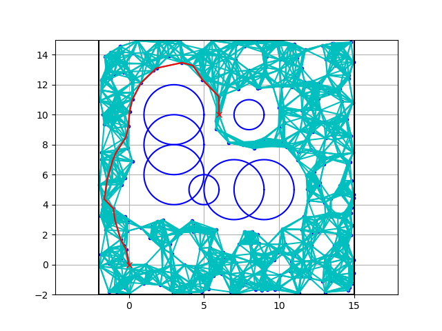
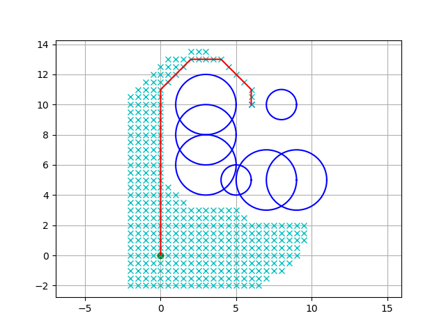
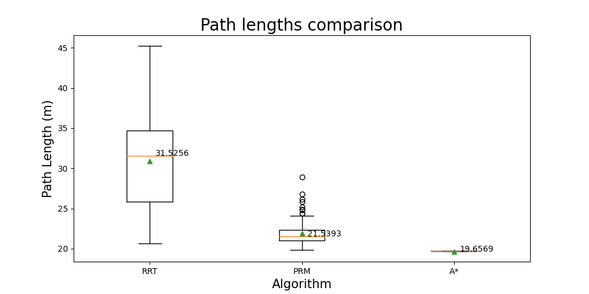
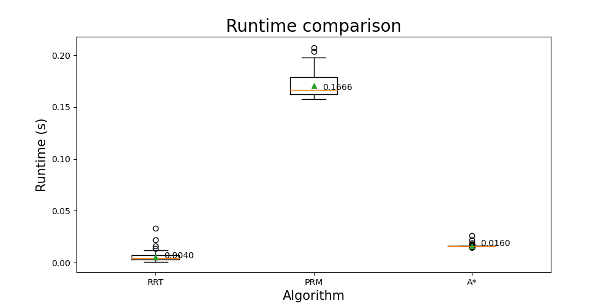

# 2D Space Robot Path Planning Algorithms Performance Analysis
Consider a mobile robot in a 2D environment. Our objective is to find a path between a start
position and a goal position. The robot is initially located at the start position, and it is expected
move to the goal position, without colliding with any obstacles in the environment. 

The main dependencies are Python packages **NumPy** and **Matplotlib**.

## Experiment Visualisation

* Start position: (0,0)
* Goal position: (6, 10)
* List of obstacles: (5, 5, 1), (3, 6, 2), (3, 8, 2), (3, 10, 2), (7, 5, 2), (9, 5, 2), (8, 10, 1) –
(x, y, radius)
* The radius of the robot: 0.8

### Randomised Rapidly-exploring Random Trees (RRT)

Randomized Rapidly-exploring Random Trees (RRT) is a motion planning algorithm commonly used in robotics and computer graphics to efficiently search high-dimensional spaces. It was introduced by Steven M. LaValle in 1998. RRT is particularly well-suited for problems involving robotic motion planning, where a robot needs to navigate from a start configuration to a goal configuration in a complex environment.

The Figure below shows algorithm's solution process.

### Probabilistic Roadmap (PRM)

Probabilistic Roadmap (PRM) is a motion planning algorithm designed for robot path planning in complex and high-dimensional configuration spaces. Developed to address challenges in real-world robotics applications, PRM was introduced by Lydia E. Kavraki, Petr Svestka, Jean-Claude Latombe, and Mark H. Overmars in 1996. The algorithm constructs a roadmap, a graph representation of the configuration space, by randomly sampling valid configurations and connecting them through collision-free paths. PRM employs a probabilistic approach, allowing for efficient exploration and representation of the environment's geometry. It has proven effective in solving motion planning problems for robots operating in environments with obstacles, providing a versatile solution for practical applications in robotics and automation.

The Figure below shows algorithm's solution process.

### A-star (A*) algorithms

The A* algorithm is a popular pathfinding algorithm commonly used in graph traversal and search problems, particularly in robotics, artificial intelligence, and computer games. Developed by Peter Hart, Nils Nilsson, and Bertram Raphael in 1968, A* is an informed search algorithm that efficiently finds the shortest path from a start node to a goal node in a graph. It combines the advantages of both Dijkstra's algorithm and Greedy Best-First Search by using a heuristic to estimate the cost from the current node to the goal. A* maintains a priority queue, called the open set, to iteratively explore the nodes with the lowest estimated total cost. The algorithm's efficiency is enhanced by the use of a heuristic function, which guides the search towards the goal while considering the cost of the path traveled. A* is widely employed in robotics, gaming, and various artificial intelligence applications where efficient and optimal pathfinding is crucial.

The Figure below shows algorithm's solution process.

## Experimental Results

**A Algorithm:**

Step into the world of optimal pathfinding with A*. This algorithm is your guide through the intricacies of graphs and grids, efficiently calculating the shortest routes from start to finish. Renowned for its speed and accuracy, A* shines in structured environments. Its ability to find the optimal path makes it a staple in navigation applications and video games, proving that even in complex scenarios, A* is the algorithmic hero you can rely on for efficient and effective path planning.

**Randomized Rapidly-exploring Random Trees (RRT):**

Dive into the realm of exploration with RRT, a sophisticated algorithm tailored for high-dimensional spaces. Whether maneuvering a robot through cluttered environments or charting the course for an autonomous drone, RRT excels in the art of discovery. With its strategic random sampling and rapid tree expansion, RRT uncovers paths that might not be optimal but showcase a remarkable exploration strategy. It's the algorithm of choice when you're ready to embrace the uncertainty of uncharted territories.

**Probabilistic Roadmap (PRM):**

Enter the strategic planning arena with PRM, the algorithmic architect of robotic roadmaps. PRM stands out for its meticulous construction of a roadmap in obstacle-rich landscapes, ensuring safe and collision-free navigation. It's the Google Maps equivalent for robots, meticulously mapping out routes to guarantee smooth traversal. PRM's strength lies in its thoughtful planning, offering a systematic approach for robots to navigate dynamic and challenging environments. It's not just a map; it's a blueprint for success in robotic exploration.
